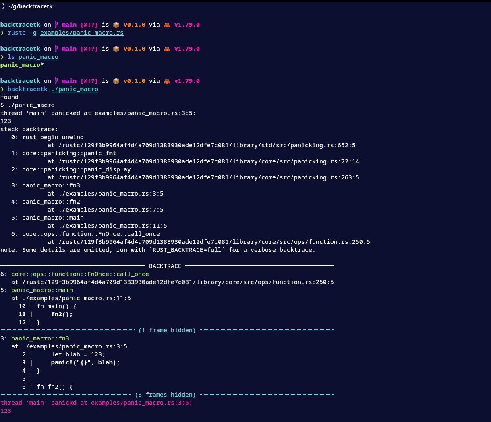
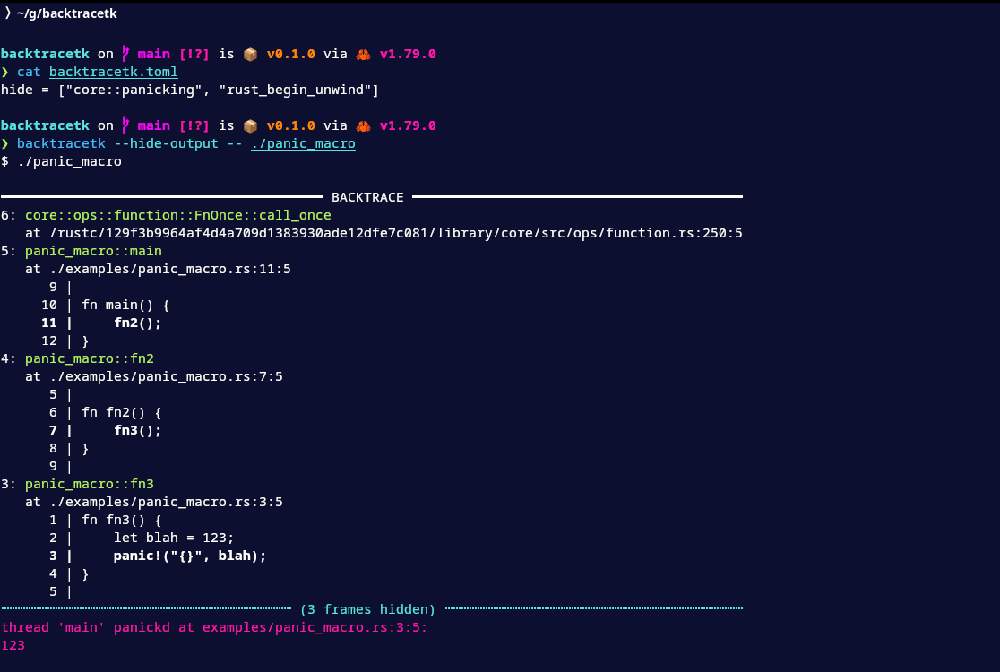

# Backtracetk

Backtracetk is a command-line tool that prints colorized Rust backtraces without needing extra dependencies. It works by capturing the output of a process, detecting anything that looks like a backtrace, and then printing it with colors to make it easier on the eyes. It also prints snippets of the code at each frame if it can find them in the filesystem.

Backtracetk is useful in situations where you can't or don't want to add runtime dependencies to your project. It is also more dynamic, allowing you to run the process many times (if it's cheap to do so) and adjust the output accordingly.

If you're okay with adding dependencies, consider looking at [color-eyre](https://crates.io/crates/color-eyre) or [color-backtrace](https://crates.io/crates/color-backtrace).

## Installation

```bash
cargo install --git https://github.com/nilehmann/backtracetk
```

## Screenshot



## Usage

```bash
$ backtracetk --help
Print colorized Rust backtraces by capturing the output of an external process

Usage: backtracetk [OPTIONS] [CMD]...

Arguments:
  [CMD]...

Options:
      --style <STYLE>                    Set the backtrace style to `short` (RUST_BACKTRACE=1) or `full`
                                         (RUST_BACKTRACE=full) [default: short] [possible values: short, full]
      --lib-backtrace <LIB_BACKTRACE>    Enable or disable `Backtrace::capture`. If this flag is set to `no`,
                                         backtracetk sets RUST_LIB_BACKTRACE=0, disabling
                                         `Backtrace::capture`. If the flag is set to `yes`, no changes are
                                         made, and the default behavior of capturing backtraces remains
                                         enabled [default: no] [possible values: yes, no]
      --clicolor-force <CLICOLOR_FORCE>  If this flag is `yes`, set CLICOLOR_FORCE=1. If the flag is `no`, no
                                         changes are made [default: yes] [possible values: yes, no]
      --hide-output                      By default, backtracetk prints each captured line as it reads it,
                                         providing immediate feedback. If this flag is set, this output is
                                         suppressed, and nothing will be printed until the program exits
  -h, --help                             Print help
```

### Configuration

Backtracetk will attempt to locate a configuration file named `backtrack.toml` or `.backtrack.toml` in the parent directories starting from where the command is executed. Currently, the only supported configuration is `hide`, which accepts a list of regex patterns.
Any frame matching one of these patterns will be hidden from the output. For example:


