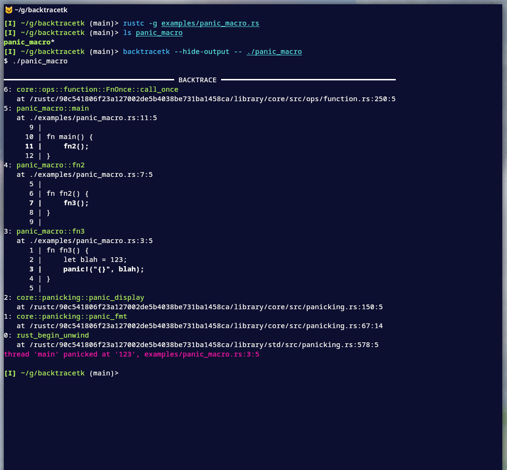

# Backtracetk

Backtracetk is a command-line tool that prints colorized Rust backtraces without needing extra dependencies.
It works by capturing the output of a Rust binary, detecting anything that looks like a backtrace, and then printing it with colors to make it easier on the eyes.
Additionally, it displays code snippets if available in the filesystem and offers configurable options to hide specific frames.

Backtracetk is useful in situations where you can't or don't want to add runtime dependencies.
It is thus more "dynamic", allowing you to run the process many times (assuming it's cheap to do so) and adjust the output accordingly without the need to recompile your code.

If you're ok with adding dependencies, consider looking at [color-eyre](https://crates.io/crates/color-eyre) or [color-backtrace](https://crates.io/crates/color-backtrace).

I've only tested this on Linux and primarily within a single project.
If you try it and encounter any issues, please share the output of your process.

## Installation

```bash
cargo install --git https://github.com/nilehmann/backtracetk
```

## Screenshot



## Usage

```bash
$ backtracetk --help
Print colorized Rust backtraces by capturing the output of an external process

Usage: backtracetk [OPTIONS] [CMD]...

Arguments:
  [CMD]...

Options:
      --print-config          Print the current detected configuration
      --print-default-config  Print the default configuration used when no configuration files are detected
  -h, --help                  Print help

```

### Configuration

Backtracetk can be configured using a TOML file named `backtracetk.toml` or `.backtracetk.toml`.
It searches for a *global* configuration file in your home directory and a *local* configuration file in the parent directories starting from the current working directory. The local configuration will override the global configuration where they overlap.

Below is a sample configuration:

```toml
# Backtracetk Configuration File

# `style` sets the backtrace detail level.
# Options:
# - "short" (default): Sets `RUST_BACKTRACE=1`
# - "full": Sets `RUST_BACKTRACE=full`
style = "short"

# `echo` controls whether backtracetk echoes captured lines.
# - true (default): Captured lines are printed as they are read
# - false: Suppresses output until the program exits
echo = true

# `env` allows specifying additional environment variables for the child process.
[env]
CLICOLOR_FORCE = "1"     # e.g., try forcing ANSI colors
RUST_LIB_BACKTRACE = "0" # e.g., disable lib backtrace

# `hyperlinks` configures the mission of hyperlinks for file paths in the backtrace output.
[hyperlinks]
enabled = true                                      # Enable or disable hyperlinking.
url = "vscode://file${FILE_PATH}:${LINE}:${COLUMN}" # Template for generating file links.

# `hide` sections define rules to exclude specific frames from the backtrace output.
# Frames can be hidden based on regex patterns or ranges between start and end patterns.

# Hide frames matching a specific regex pattern.
[[hide]]
pattern = "panic_macro::fn2" # Regex pattern to match frames for exclusion.

# Hide frames within a range defined by start and end regex patterns.
[[hide]]
begin = "core::panicking" # Start pattern.
end = "rust_begin_unwind" # End pattern (optional). If omitted, hides all subsequent frames.
```
