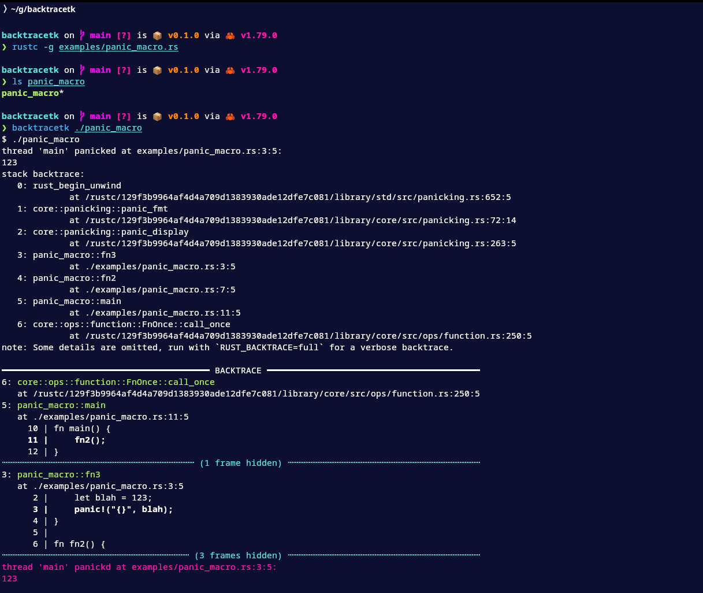

# Backtracetk

Backtracetk is a command line tool to print colorized Rust backtraces without the need to add extra
dependencies to your project.
It works by capturing the output of a process, detecting anything that looks like a backtrace, and then printing
it with colors to be easier on the eyes.
It also prints snippets of the code at each frame if it can find them in the file system.

## Installation

```bash
cargo install --git https://github.com/nilehmann/backtracetk
```

## Screenshot



## Usage

```bash
$ backtracetk --help
Print colorized Rust backtraces by capturing the output of an external process

Usage: backtracetk [OPTIONS] [CMD]...

Arguments:
  [CMD]...

Options:
      --style <STYLE>     Set the backtrace style to short (RUST_BACKTRACE=1) or full (RUST_BACKTRACE=full)
                          [default: short] [possible values: short, full]
      --no-lib-backtrace  Set RUST_LIB_BACKTRACE=0
      --hide-output       By default, backtracetk prints every captured line as it reads it to get immediate
                          feedback. If this flag is set, this output is suppressed and nothing will be printed
                          until the program exits
  -h, --help              Print help
```
